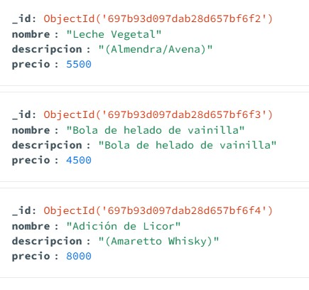

# Visual SC Proyecto
Este es el espacio oficial del proyecto **Visual SC** 

# Descripción del proyecto

Este proyecto correponde a un prototipo en el marco de la creación de la empresa **Visual SC** 
Un prospecto de compañía en el marco del concurso de la hackabox

https://sandboxfundacion.org/

cómo parte del apoyo al enprendimiento juvenil

En ese sentido, se solicita a los desarrolladores del equipo realizar un rpototipo de alta fidelidad bajo los siguientes pasos

1. Tomar el menú de un establecimiento de cafe o restaurante
2. Tomar foto del menú
3. Hacer una aplicación web con el catálogo que incluya una interfaz para personas discapacitadas

# Stack Tecnológico

### Frontend


### Backend


# Modelo de Menu y almacenamiento en base de datos

## Tecnologías del backend
### Runtime

### Framework

<p>MongoDB Community Server (Ejecución local en puerto 27017) o MongoDB Atlas (Cloud).</p>

### ORM
Mongoose

## Arquitectura del proyecto
Este backend posee un modelo de MVC (Modelo-Vista-Controlador), para las operaciones CRUD de la base de datos
(Crear,Leer,Actualizar y Eliminar)

```
VISUAL-CSD-BACKEND/
│
├── 📁 MVC/
│   └── 📁 controllers/
│   └── 📁 models/
│   └── 📁 routes/
```
### Estructura de los Modelos

Dentro de los modelos, se encuentra el modelo general del archivo **MenuItem.js**

Este archivo representa la estructura básica de una bebida o plato para un Menú de un café
```
const { Schema, model } = require('mongoose');

//1. Crear el modelo base
const baseMenu = {
    discrimatorKey:"categoria",
    collection:"menuItems"
}

const menuItemSchema = new Schema({
    descripcion:{
        type:String,
        required:true
    },
    nombre:{
        type:String,
        required:true
    },
    precio:{
        type:Number,
        required:true    
    },
},baseMenu)  

//modelo base
const MenuItem = model("MenuItem",menuItemSchema);

module.exports = {
    MenuItem
}
```

Este modelo se exporta hacia los demás modelos, ya que por generalidad todos los modelos de nuestro menú comparten características en común, principalmente el **el precio, la descripción, y el nombre**

### Ejemplo de generación de modelo

El archivo adiciones, corresponde a la parte de Menú de las adiciones del café

```
const { Schema,model} = require('mongoose');
const { MenuItem } = require('./MenuItem');

const adicionesSchema =  MenuItem.discriminator('adiciones',new Schema({}));

module.exports = model("adiciones",adicionesSchema,"adiciones")
```
Este archivo utiliza el método de mongoose **discriminator** el cual aplica la herencia del menú general extendiéndolo al modelo de adiciones, de tal forma que en una base de datos de MongoDB, la base de datos quedaría así

<p align="center">

</p>